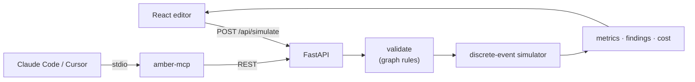

# Amber

[](https://github.com/dhruvraajeev/amber/actions/workflows/ci.yml)
[](LICENSE)

**A flight simulator for AI app architectures.** Sketch a system on a canvas, drive traffic
through it, and see where latency, GPU memory, and cost break, before you build it.


**Try it live: [amber on Azure](https://amber.victoriousrock-f5544b42.westus.azurecontainerapps.io)**
(or [dhruvraajeev.github.io/amber](https://dhruvraajeev.github.io/amber)). It sleeps when idle, so
the first load can take a few seconds.

## Why

"Will this hold 400 requests a second?" and "what will the GPUs cost?" usually get answered after
the system is built, by a load test or a bill. Amber answers them on a whiteboard. It is a
discrete-event simulator: it plays every request through your design, one at a time, with realistic
latency distributions, queues, connection pools, rate limits, agent loops, and continuous batching on
GPUs. Then it tells you, in plain English, what broke and why.

The simulator is checked against queueing theory (M/M/1 and M/M/c agree within 1%), and it is
deterministic: the same design and seed always give the same result, byte for byte.

## What you can do

- **Build on a canvas.** Drag in users, load balancers, services, caches, databases, AI agents, and
  LLMs, then connect them. Every setting is a form, with presets for real GPUs, open models, and
  hosted LLM APIs. Mistakes are highlighted as you make them.
- **Start from a template.** A classic web app, a RAG chatbot on a hosted LLM, and a tool-using
  agent on a self-hosted GPU.
- **Run and replay.** Simulate 10 to 600 seconds of constant, ramping, or spiking traffic. Watch it
  replay on the canvas as edges thicken with load and nodes glow as they fill up.
- **Read the results.** p50/p95/p99 latency, time to first token, throughput, errors, per-node load
  and queues, GPU KV-cache use and batch size, where the slowest 1% of requests spent their time,
  and a monthly cost breakdown.
- **Get findings, not just charts.** For example, *"Chat API is at 98% capacity. Requests queue for
  up to 22 waiting."* or *"Llama 3.1 8B on L4 GPU memory is full 53% of the time. Requests wait for KV cache space."*
- **Compare.** Pin two runs and see every metric side by side, marked better or worse.
- **Save and share.** Export a design as JSON and open it again later, or hand it to an agent.
- **Let an AI agent use it.** Connect Claude Code, Cursor, or Claude Desktop over MCP, and your
  agent can model your codebase, test it against a target, and hand you a link that opens its
  design in the editor.

## Run it yourself

With [Docker](https://docs.docker.com/get-started/get-docker/), one command, no build:

```bash
docker run --rm -p 8000:8000 ghcr.io/dhruvraajeev/amber:latest
```

Open <http://localhost:8000> and pick a template. To build the image from source instead:

```bash
git clone https://github.com/dhruvraajeev/amber && cd amber
docker build -t amber . && docker run --rm -p 8000:8000 amber
```

## Use it from Claude Code, Cursor, or Claude Desktop (MCP)

`mcp/` is an [MCP](https://modelcontextprotocol.io) server. Once it's connected, your AI assistant
can design systems, run them through Amber, and iterate until they meet a target. The only
prerequisite is [uv](https://docs.astral.sh/uv/getting-started/installation/); `uvx` fetches and runs
the server on demand.

**Claude Code:**

```bash
claude mcp add amber -s user -- uvx --from "git+https://github.com/dhruvraajeev/amber#subdirectory=mcp" amber-mcp
```

`-s user` makes it available in every project. Check it with `claude mcp list`, or `/mcp` inside a
session.

**Cursor** (`~/.cursor/mcp.json`, or `.cursor/mcp.json` in one project) and **Claude Desktop**
(Settings → Developer → Edit Config, which opens `claude_desktop_config.json`) use the same entry:

```json
{
  "mcpServers": {
    "amber": {
      "command": "uvx",
      "args": ["--from", "git+https://github.com/dhruvraajeev/amber#subdirectory=mcp", "amber-mcp"]
    }
  }
}
```

Restart the app afterwards. If Claude Desktop can't find `uvx`, replace `"uvx"` with the full path
that `which uvx` prints: desktop apps don't always see your shell's `PATH`.

### What your agent gets

| Tool | What it does |
|---|---|
| `list_templates` | The starter designs, complete and valid, to copy and change |
| `get_presets` | The GPUs, models, hosted LLMs, databases, and services a design can name |
| `validate_design` | Checks a design and lists every problem, naming the node at fault |
| `simulate` | Runs a design: latency percentiles, errors, bottlenecks, monthly cost, and `open_url` |

`open_url` is a link that opens the agent's design in Amber's editor, laid out and ready to run and
replay. The design travels inside the link's `#` fragment, which browsers never send to a server, so
nothing is stored anywhere.

### Model your own codebase

Amber never reads your code: your agent does. It reads the repository, maps what it finds to Amber
nodes, runs it, and reports back. In Claude Code, the server ships a prompt that walks through
exactly that:

```text
/mcp__amber__model_codebase 300 requests/second with p99 under 200 ms for less than $800 a month
```

In Cursor or Claude Desktop, or in plain words in Claude Code, ask for the same thing:

> *"Read this codebase and model its architecture in Amber: the API server, its database pool, the
> Redis cache, and the OpenAI calls. Will it hold 300 requests a second with p99 under 200 ms? If
> not, find the cheapest change that gets there, and give me the Amber link."*

The agent will:

1. Find the entry points, database and cache clients, LLM SDK calls, and agent loops, plus replica
   counts, pool sizes, and timeouts from your deploy config.
2. Map them to nodes. A web server is a `service`, Postgres is a `database` with its real pool size,
   Redis is a `cache`, an OpenAI or Anthropic call is a hosted `llm`, and a tool loop is an `agent`.
3. List every number it had to assume, such as latencies or hit rates, validate the design, and
   simulate it.
4. Report latency, errors, cost, and bottlenecks, tied back to your files. Where the target is
   missed, it changes capacity, re-runs, and tells you which setting in your code or config each fix
   corresponds to.
5. Give you the `open_url`, so you can see the design, tweak it on the canvas, and run it yourself.

Other things to ask: *"Design a RAG chatbot for 50 requests/second under $1,000 a month"*, or
*"Would self-hosting Llama 3.1 8B on L4s be cheaper than our hosted LLM at our traffic?"*

### Options

- **A local Amber.** The tools call the live Amber by default, which allows 30 simulations a minute
  per address. To use your own, run the Docker image and point the server at it: in Claude Code add
  `-e AMBER_API_URL=http://localhost:8000` before the `--`; in the JSON configs add
  `"env": {"AMBER_API_URL": "http://localhost:8000"}`. `open_url` then links to your local editor too.
- **Install once instead of fetching with `uvx`:**
  `uv tool install "git+https://github.com/dhruvraajeev/amber#subdirectory=mcp"`, then use
  `amber-mcp` as the command.

## How it works



The editor and the API share one set of contracts: Pydantic models, exported as OpenAPI and
generated into TypeScript types, with CI failing on any drift. The same graph rules run in the
browser for instant feedback and on the server as the authority, both tested against one shared set
of fixtures. The simulator is a from-scratch, generator-based discrete-event engine (the SimPy idea
in about 200 lines). Every node kind is a small class that turns a request into simulated time.

- [docs/architecture.md](docs/architecture.md): the whole system, the life of a run, guardrails,
  deployment, and the MCP server.
- [docs/simulation-model.md](docs/simulation-model.md): how the simulator models traffic, queues,
  agents, GPU batching, and cost, in plain English.

## How accurate is it?

The core is verified. `backend/tests/sim/test_queueing_theory.py` runs Amber against textbook
queueing systems with exact answers:

| System | Theory | Amber (100 runs × 600 s) |
|---|---|---|
| M/M/1: 7 req/s in, 10 req/s served | 233.3 ms mean wait | 233.0 ms (−0.1%) |
| M/M/c: 15 req/s in, 2 servers × 10 req/s | 128.6 ms mean wait | 129.6 ms (+0.8%) |

The LLM serving model is **not yet calibrated**. Self-hosted GPU timing comes from one uncalibrated
profile (a rough Llama 3.1 8B FP16 on an L4), and presets carry prices marked "verify." Treat AI
latency and cost figures as informed estimates. **Calibration against real hardware (llama.cpp
benchmarks, with the measured error published here) is coming in v1.1.**

## Limitations

Amber is a model, not a benchmark, and it simplifies on purpose. The same list is in the app under
**Model**.

- Traffic is open-loop: users keep arriving at the set rate however slow the system gets.
- Calls are synchronous, and services hold one thread per request, including downstream calls. There
  are no async queues between services, no retries between your own services, and no circuit
  breakers.
- Network latency isn't modeled separately; fold it into each node's latency.
- Self-hosted LLMs never preempt an admitted request, and prefill and decode times are linear in
  tokens and batch size. Speculative decoding accepts each draft token at a fixed rate.
- Hosted LLM APIs have unlimited concurrency apart from their rate limit.
- Monthly cost assumes the simulated window repeats all month.
- The public instance limits runs to 600 simulated seconds, 5,000 requests/second, about 200,000
  requests, 50 nodes, and 30 simulations a minute per address.
- Designs live in your browser (autosave) and in files you export; there are no accounts or
  server-side saved designs yet.

## Tech stack

| Layer | Stack |
|---|---|
| Simulator | Python 3.12, a hand-written discrete-event kernel, no simulation libraries |
| API | FastAPI, Pydantic 2, uvicorn |
| Frontend | React 19, TypeScript, Vite, React Flow, Zustand, Tailwind CSS 4, lucide icons, Geist |
| MCP server | Python MCP SDK (FastMCP), httpx |
| Tooling | uv, ruff, pytest, respx, Vitest, oxlint, openapi-typescript |
| Delivery | Docker (multi-stage, multi-arch), GitHub Actions, GitHub Container Registry, Azure Container Apps (scales to zero) |

## Develop

Needs [uv](https://docs.astral.sh/uv/) and Node 24 or newer. Two terminals:

```bash
cd backend && uv sync && uv run uvicorn amber.api.app:app --reload
```

```bash
cd frontend && npm ci && npm run dev
```

Open <http://localhost:5173>. Vite proxies `/api` to the backend on :8000.

### Test

```bash
cd backend && uv run pytest && uv run ruff check . && uv run ruff format --check .
```

```bash
cd frontend && npm test && npx tsc -b && npm run lint
```

```bash
cd mcp && uv run pytest && uv run ruff check .
```

The backend suite takes about 20 s, most of it the queueing-theory checks. `uv run pytest -m "not slow"`
skips the timing-sensitive performance tests, as CI does.

### Simulate from a terminal

```bash
cd backend && uv run python -m amber.cli ../shared/templates/classic-web-app.json --duration 60 --seed 1
```

It prints the summary, per-node load, cost, and findings; `--out result.json` writes the full result.

### Change a contract

After editing `backend/amber/contracts.py`, run `npm run gen:types` in `frontend/` to regenerate the
TypeScript types. CI fails if you forget.

## Roadmap

- **v1.1:** calibration. Benchmark llama.cpp on real hardware, fit the GPU timing model, and publish
  the simulator's measured error.
- **v1.2:** hosted-API calibration, saved designs with share links, push-to-deploy, OpenTelemetry
  traces, and an accessibility pass.

## License

MIT. See [LICENSE](LICENSE).
