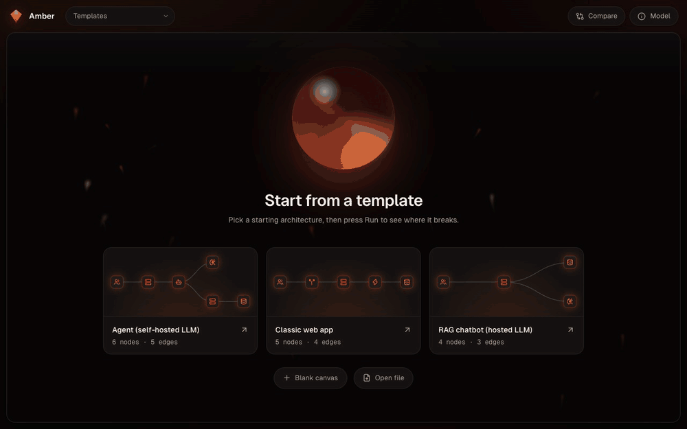
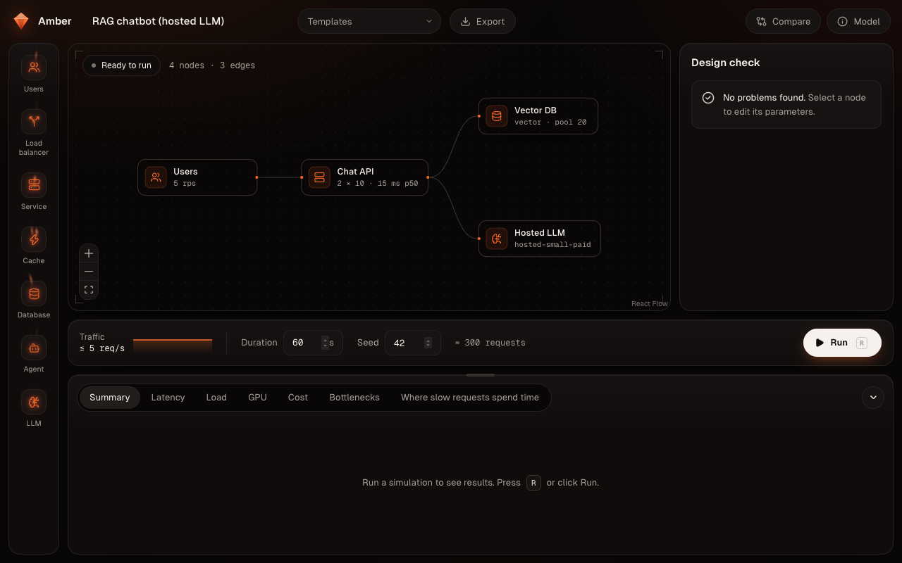
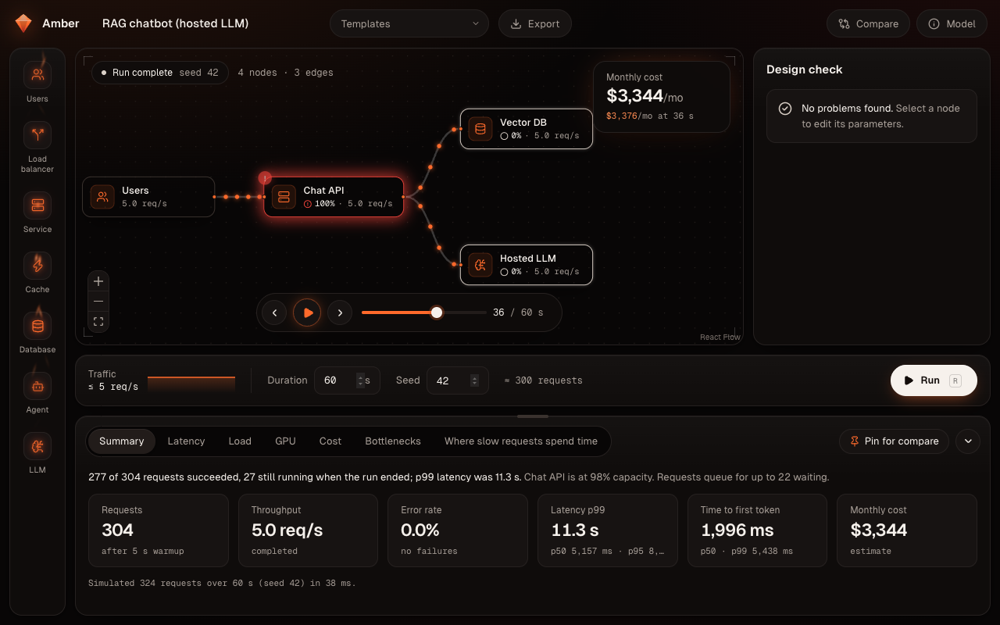
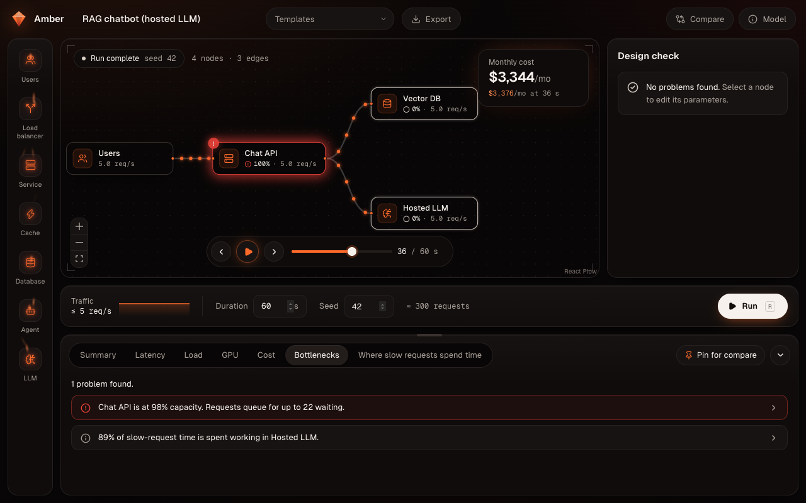
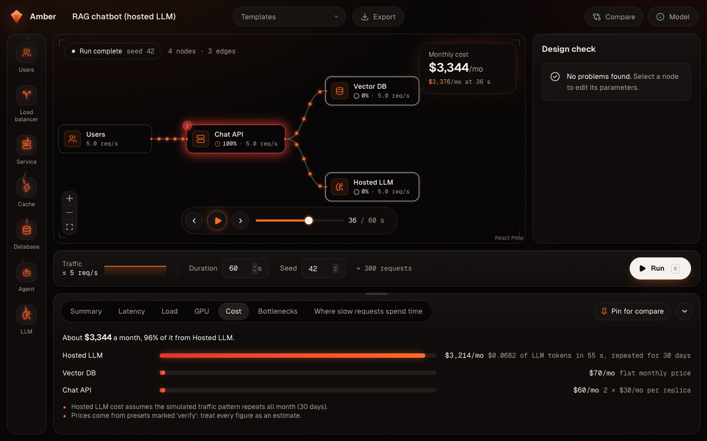
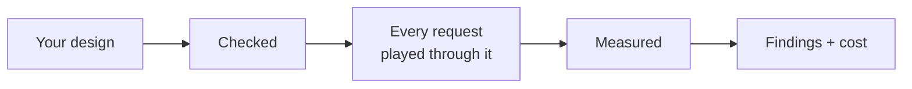
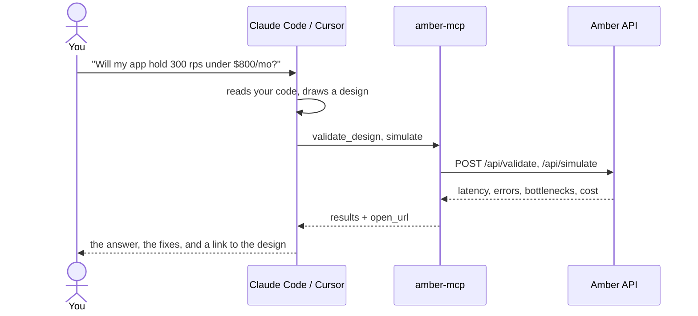
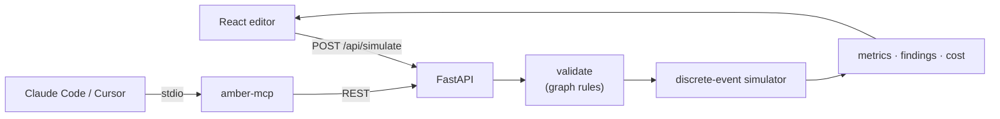

# Amber

[](https://github.com/dhruvraajeev/amber/actions/workflows/ci.yml)
[](LICENSE)

**Draw your app's architecture, send pretend traffic through it, and see where it gets slow and what it
will cost, before you build it.** Think of it as a flight simulator for web and AI systems.



**Try it live: [amber on Azure](https://amber.victoriousrock-f5544b42.westus.azurecontainerapps.io)**
(or [dhruvraajeev.github.io/amber](https://dhruvraajeev.github.io/amber)). It sleeps when idle, so
the first load can take a few seconds.

## What Amber answers

1. **Will it keep up?** Can this design handle 400 requests a second, or does it start turning people
   away?
2. **Where does it slow down?** Which box on the diagram is the one everything waits for?
3. **What will it cost?** Servers, databases, GPUs, and LLM tokens, per month.

Normally you find these out after launch, from a load test or a bill. Amber lets you find out on a
whiteboard. It plays every request through your design one at a time, with realistic delays, waiting
lines, connection limits, rate limits, AI agent loops, and GPUs that batch requests together. Then it
tells you in plain English what broke and why.

It is also repeatable: the same design with the same seed (the number that fixes the random choices)
always gives exactly the same result.

## Amber in 4 pictures

**1. Draw the system.** Drag in boxes (users, services, caches, databases, AI agents, LLMs) and
connect them. Mistakes show up as you make them.



**2. Run it.** Traffic replays on the canvas: busy boxes glow, and the summary gives the numbers that
matter.



**3. Read the findings.** Amber names the problem and the box it's in.



**4. See the bill.** Monthly cost, box by box, with how each number was worked out.



## Words you'll see

| Word | What it means |
|---|---|
| **Requests per second (rps)** | How many requests arrive each second. Your traffic. |
| **Latency** | How long one request takes, start to finish. |
| **p50 / p95 / p99** | Latency percentiles. p99 = 800 ms means 99 of 100 requests were faster than 800 ms. p50 is the typical request; p99 is the slow tail your unluckiest users feel. |
| **Throughput** | How many requests actually finish each second. |
| **Queue** | The waiting line in front of something busy. |
| **Replica** | One copy of a service. More replicas, more requests handled at once. |
| **Utilization (busy %)** | How much of a box's capacity is in use. Near 100%, waiting lines grow fast. |
| **Cache hit rate** | How often the cache already has the answer, so the slower thing behind it is skipped. |
| **Token** | The unit LLMs read and write, roughly ¾ of a word. Hosted LLMs charge per token. |
| **TTFT** | Time to first token: how long until an LLM starts answering. |
| **KV cache** | GPU memory an LLM uses to remember each conversation while it answers. When it's full, new requests wait. |
| **GPU memory** | Holds the model's weights plus the KV cache. A bigger model leaves less room for requests. |

## How a run works



1. **Your design.** Boxes and arrows, drawn on the canvas or written as JSON.
2. **Checked.** Amber finds anything that can't work (a box nothing reaches, a model too big for its
   GPU) and points at it.
3. **Every request played through it.** Requests arrive at random, like real users, and each one
   waits, works, and calls the next box, exactly as your arrows say.
4. **Measured.** Every second, Amber records how busy each box is and how long requests took.
5. **Findings + cost.** It turns that into plain-English problems and a monthly bill.

The details are in [docs/simulation-model.md](docs/simulation-model.md).

## What you can do

- **Build on a canvas.** Users, load balancers, services, caches, databases, AI agents, and LLMs.
  Every setting is a form, with presets for real GPUs, open models, and hosted LLM APIs.
- **Start from a template.** A classic web app, a RAG chatbot on a hosted LLM, and a tool-using
  agent on a self-hosted GPU.
- **Run and replay.** Simulate 10 to 600 seconds of steady, ramping, or spiking traffic, and watch it
  replay on the canvas as arrows thicken with load and boxes glow as they fill up.
- **Read the results.** p50/p95/p99 latency, time to first token, throughput, errors, per-box load
  and queues, GPU KV-cache use and batch size, where the slowest 1% of requests spent their time,
  and a monthly cost breakdown.
- **Get findings, not just charts.** For example, *"Chat API is at 98% capacity. Requests queue for
  up to 22 waiting."* or *"Llama 3.1 8B on L4 GPU memory is full 53% of the time. Requests wait for
  KV cache space."*
- **Compare.** Pin two runs and see every metric side by side, marked better or worse.
- **Save and share.** Export a design as JSON and open it again later, or hand it to an agent.
- **Let an AI agent use it.** Connect Claude Code, Cursor, or Claude Desktop, and your agent can
  model your codebase, test it against a target, and hand you a link that opens its design in the
  editor.

## Run it yourself

With [Docker](https://docs.docker.com/get-started/get-docker/), one command, no build:

```bash
docker run --rm -p 8000:8000 ghcr.io/dhruvraajeev/amber:latest
```

Open <http://localhost:8000> and pick a template. To build the image from source instead:

```bash
git clone https://github.com/dhruvraajeev/amber && cd amber
docker build -t amber . && docker run --rm -p 8000:8000 amber
```

## Let your AI agent use it (MCP)

[MCP](https://modelcontextprotocol.io) is how AI assistants plug in tools. `mcp/` is an MCP server:
once it's connected, your assistant can design systems, run them through Amber, and keep changing
them until they meet a target.



The only thing to install first is [uv](https://docs.astral.sh/uv/getting-started/installation/);
`uvx` fetches and runs the server on demand.

**Claude Code:**

```bash
claude mcp add amber -s user -- uvx --from "git+https://github.com/dhruvraajeev/amber#subdirectory=mcp" amber-mcp
```

`-s user` makes it available in every project. Check it with `claude mcp list`, or `/mcp` inside a
session.

**Cursor** (`~/.cursor/mcp.json`, or `.cursor/mcp.json` in one project) and **Claude Desktop**
(Settings → Developer → Edit Config, which opens `claude_desktop_config.json`) use the same entry:

```json
{
  "mcpServers": {
    "amber": {
      "command": "uvx",
      "args": ["--from", "git+https://github.com/dhruvraajeev/amber#subdirectory=mcp", "amber-mcp"]
    }
  }
}
```

Restart the app afterwards. If Claude Desktop can't find `uvx`, replace `"uvx"` with the full path
that `which uvx` prints: desktop apps don't always see your shell's `PATH`.

### What your agent gets

| Tool | What it does |
|---|---|
| `list_templates` | The starter designs, complete and valid, to copy and change |
| `get_presets` | The GPUs, models, hosted LLMs, databases, and services a design can name |
| `validate_design` | Checks a design and lists every problem, naming the box at fault |
| `simulate` | Runs a design: latency percentiles, errors, bottlenecks, monthly cost, and `open_url` |

`open_url` is a link that opens the agent's design in Amber's editor, laid out and ready to run and
replay. The design travels inside the link's `#` fragment, which browsers never send to a server, so
nothing is stored anywhere.

### Model your own codebase

Amber never reads your code: your agent does. It reads the repository, maps what it finds to Amber
boxes, runs it, and reports back. In Claude Code, the server ships a prompt that walks through
exactly that:

```text
/mcp__amber__model_codebase 300 requests/second with p99 under 200 ms for less than $800 a month
```

In Cursor or Claude Desktop, or in plain words in Claude Code, ask for the same thing:

> *"Read this codebase and model its architecture in Amber: the API server, its database pool, the
> Redis cache, and the OpenAI calls. Will it hold 300 requests a second with p99 under 200 ms? If
> not, find the cheapest change that gets there, and give me the Amber link."*

The agent will:

1. Find the entry points, database and cache clients, LLM SDK calls, and agent loops, plus replica
   counts, pool sizes, and timeouts from your deploy config.
2. Map them to boxes. A web server is a `service`, Postgres is a `database` with its real pool size,
   Redis is a `cache`, an OpenAI or Anthropic call is a hosted `llm`, and a tool loop is an `agent`.
3. List every number it had to assume, such as latencies or hit rates, validate the design, and
   simulate it.
4. Report latency, errors, cost, and bottlenecks, tied back to your files. Where the target is
   missed, it changes capacity, re-runs, and tells you which setting in your code or config each fix
   corresponds to.
5. Give you the `open_url`, so you can see the design, tweak it on the canvas, and run it yourself.

Three rules keep the answer honest, and the agent is told to follow them:

- **Count what really runs in parallel.** Python threads doing CPU work share one core (Python's
  GIL), so a Python server's capacity is its number of worker processes, not threads. Async servers
  that mostly wait on I/O can handle many requests at once.
- **Use delays measured under load.** A query that takes 5 ms on an idle laptop can take 15 ms at
  peak. If the real numbers aren't known, the agent says so.
- **Near full capacity, small errors get big.** If anything is over 80% busy, the agent warns that
  its p99 is fragile (see [How accurate is it?](#how-accurate-is-it)).

Other things to ask: *"Design a RAG chatbot for 50 requests/second under $1,000 a month"*, or
*"Would self-hosting Llama 3.1 8B on L4s be cheaper than our hosted LLM at our traffic?"*

### Options

- **A local Amber.** The tools call the live Amber by default, which allows 30 simulations a minute
  per address. To use your own, run the Docker image and point the server at it: in Claude Code add
  `-e AMBER_API_URL=http://localhost:8000` before the `--`; in the JSON configs add
  `"env": {"AMBER_API_URL": "http://localhost:8000"}`. `open_url` then links to your local editor too.
- **Install once instead of fetching with `uvx`:**
  `uv tool install "git+https://github.com/dhruvraajeev/amber#subdirectory=mcp"`, then use
  `amber-mcp` as the command.

## How accurate is it?

Short version: **the simulator's math is right; the answer is only as good as the numbers you put in.**

| What | How it was checked | Result |
|---|---|---|
| **Queueing math** | Against textbook systems with exact answers (`backend/tests/sim/test_queueing_theory.py`) | Within 1% |
| **Cost arithmetic** | Against the exact formula, over hundreds of runs | Flat prices are exact. Hosted-LLM token cost is within 2.5%, even for 30-second runs |
| **A real running system** | Amber predicted its own API, which was then load-tested for real | Close when set up right, far off when set up wrong (below) |
| **GPU serving** | Not yet: one rough timing profile | An informed estimate until v1.1 |

**The textbook checks** (100 runs × 600 s each):

| System | Theory | Amber |
|---|---|---|
| M/M/1: 7 req/s in, 10 req/s served | 233.3 ms mean wait | 233.0 ms (−0.1%) |
| M/M/c: 15 req/s in, 2 servers × 10 req/s | 128.6 ms mean wait | 129.6 ms (+0.8%) |

**The real system.** Amber's own `/api/simulate` endpoint (about 28 ms per call) was modeled in Amber,
then hit with real traffic. Latency p50 / p95 / p99 in ms, measured 2026-09-25 on an Apple-silicon
Mac:

| How busy | Real | Amber, 1 worker (right) | Amber, 2 workers (wrong) |
|---|---|---|---|
| 50% | 45 / 120 / 159 | 32 / 83 / 117 | 26 / 40 / 51 |
| 80% | 76 / 249 / 316 | 54 / 172 / 239 | 27 / 46 / 61 |
| 90% | 213 / 696 / 805 | 78 / 265 / 372 | 28 / 49 / 65 |

The API runs two simulations "at once" in threads, but Python's GIL makes them share one core. Model
it as 2 workers, as the code reads, and p99 comes out **12× too low**. Model it as 1 worker and Amber
runs 25–35% low at normal load, because a busy machine is slower than an idle one. Give Amber the
service time a loaded machine really has (5–10% slower) and its p99 at 90% busy is 581–895 ms, around
the real 805 ms.

**Why the inputs matter so much.** Near full capacity, a small error in one delay turns into a big
error in p99. Same system, 90% busy, service time nudged up:

| Service time | +0% | +5% | +10% | +20% |
|---|---|---|---|---|
| p99 | 402 ms | 581 ms | 895 ms | 13.8 s |

**LLM serving is not calibrated yet.** Self-hosted GPU timing comes from one rough profile (Llama 3.1
8B FP16 on an L4), and presets carry prices marked "verify." Treat AI latency and cost figures as
informed estimates. **Calibration against real hardware (llama.cpp benchmarks, with the measured error
published here) is coming in v1.1.**

## Limitations

Amber is a model, not a benchmark, and it simplifies on purpose. The same list is in the app under
**Model**.

- Traffic is open-loop: users keep arriving at the set rate however slow the system gets.
- Calls are synchronous, and services hold one thread per request, including downstream calls. There
  are no async queues between services, no retries between your own services, and no circuit
  breakers.
- Network latency isn't modeled separately; fold it into each box's latency.
- Self-hosted LLMs never preempt an admitted request, and prefill and decode times are linear in
  tokens and batch size. Speculative decoding accepts each draft token at a fixed rate.
- A self-hosted LLM's decode step doesn't get slower as conversations get longer yet, so long-context
  agents look faster than they are (v1.1).
- GPU memory doesn't set aside room for the model's working memory (activations) yet, so a GPU fits a
  few more requests than it really would (v1.1).
- Hosted LLM APIs have unlimited concurrency apart from their rate limit.
- Monthly cost assumes the simulated window repeats all month.
- The public instance limits runs to 600 simulated seconds, 5,000 requests/second, about 200,000
  requests, 50 nodes, and 30 simulations a minute per address.
- Designs live in your browser (autosave) and in files you export; there are no accounts or
  server-side saved designs yet.

<details>
<summary><b>For developers</b>: architecture, local setup, tests, and the tech stack</summary>

### How it's built



The editor and the API share one set of contracts: Pydantic models, exported as OpenAPI and
generated into TypeScript types, with CI failing on any drift. The same graph rules run in the
browser for instant feedback and on the server as the authority, both tested against one shared set
of fixtures. The simulator is a from-scratch, generator-based discrete-event engine (the SimPy idea
in about 200 lines). Every node kind is a small class that turns a request into simulated time.

- [docs/architecture.md](docs/architecture.md): the whole system, the life of a run, guardrails,
  deployment, and the MCP server.
- [docs/simulation-model.md](docs/simulation-model.md): how the simulator models traffic, queues,
  agents, GPU batching, and cost, in plain English.

### Develop

Needs [uv](https://docs.astral.sh/uv/) and Node 24 or newer. Two terminals:

```bash
cd backend && uv sync && uv run uvicorn amber.api.app:app --reload
```

```bash
cd frontend && npm ci && npm run dev
```

Open <http://localhost:5173>. Vite proxies `/api` to the backend on :8000.

### Test

```bash
cd backend && uv run pytest && uv run ruff check . && uv run ruff format --check .
```

```bash
cd frontend && npm test && npx tsc -b && npm run lint
```

```bash
cd mcp && uv run pytest && uv run ruff check .
```

The backend suite takes about 20 s, most of it the queueing-theory checks. `uv run pytest -m "not slow"`
skips the timing-sensitive performance tests, as CI does.

### Simulate from a terminal

```bash
cd backend && uv run python -m amber.cli ../shared/templates/classic-web-app.json --duration 60 --seed 1
```

It prints the summary, per-node load, cost, and findings; `--out result.json` writes the full result.

### Change a contract

After editing `backend/amber/contracts.py`, run `npm run gen:types` in `frontend/` to regenerate the
TypeScript types. CI fails if you forget.

### Tech stack

| Layer | Stack |
|---|---|
| Simulator | Python 3.12, a hand-written discrete-event kernel, no simulation libraries |
| API | FastAPI, Pydantic 2, uvicorn |
| Frontend | React 19, TypeScript, Vite, React Flow, Zustand, Tailwind CSS 4, lucide icons, Geist |
| MCP server | Python MCP SDK (FastMCP), httpx |
| Tooling | uv, ruff, pytest, respx, Vitest, oxlint, openapi-typescript |
| Delivery | Docker (multi-stage, multi-arch), GitHub Actions, GitHub Container Registry, Azure Container Apps (scales to zero) |

</details>

## Roadmap

- **v1.1:** calibration. Benchmark llama.cpp on real hardware, fit the GPU timing model, and publish
  the simulator's measured error.
- **v1.2:** hosted-API calibration, saved designs with share links, push-to-deploy, OpenTelemetry
  traces, and an accessibility pass.

## License

MIT. See [LICENSE](LICENSE).
