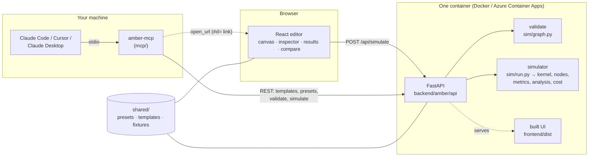
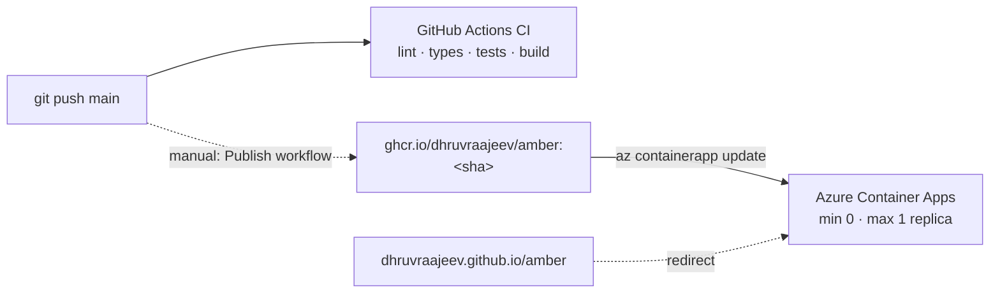

# Amber's architecture

Amber is three programs that share one set of contracts: a React editor, a Python API with the
simulator inside it, and a small MCP server that lets AI agents use that API. This page follows a
design from the canvas to a result and back, then covers the parts around that path: contracts,
validation, determinism, guardrails, deployment, and the MCP server. How the simulator itself models
traffic, queues, and GPUs is in [simulation-model.md](simulation-model.md).

## Repository layout

| Path | What it is |
|---|---|
| `backend/amber/contracts.py` | The data contracts (design, run config, run result) as Pydantic models. The source of truth. |
| `backend/amber/sim/` | The simulator: `kernel.py` (discrete-event engine), `rng.py`, `arrivals.py`, `nodes/` (one file per node kind), `metrics.py`, `analysis.py`, `cost.py`, `graph.py` (validation), `run.py` (entry point). |
| `backend/amber/api/` | FastAPI app: routes, error shapes, rate limit and body-size guardrails, the OpenAPI export. |
| `backend/amber/cli.py` | Run a design from a terminal, no UI or server needed. |
| `frontend/src/` | React 19 + TypeScript editor: `canvas/` (React Flow), `inspector/`, `run/`, `dashboard/`, `compare/`, `store/` (Zustand), `lib/` (validation, estimates, file and link import). |
| `frontend/src/api/generated.ts` | TypeScript types generated from the backend's OpenAPI schema. Never edited by hand. |
| `mcp/amber_mcp/server.py` | The MCP server: four tools and one prompt, all thin wrappers over the REST API. |
| `shared/` | JSON both sides read: `presets/` (GPUs, models, hosted LLMs, databases, services), `templates/` (the three starter designs), `fixtures/graph/` (validation test cases). |
| `Dockerfile` | One image: builds the UI, then serves it and the API from one origin. |
| `.github/workflows/` | `ci.yml` (every push), `publish.yml` (manual image push to ghcr.io), `pages.yml` (a redirect from GitHub Pages). |

## The life of a run

1. **Edit.** The design lives in one Zustand store (`store/designSlice.ts`) and is autosaved to
   `localStorage` on every change. React Flow only draws it: node moves and new edges go back to
   the store, never the other way round.
2. **Check, instantly.** As you edit, `lib/validate.ts` runs the graph rules (a users node, no
   cycles, the right edges per kind, parameter ranges, run limits) and the canvas highlights the
   offending nodes. No request is made for this.
3. **Run.** Pressing Run validates once more, then `POST /api/simulate` with `{design, config}`.
4. **Validate again, on the server.** `sim/graph.py` applies the same rules to the raw JSON and
   answers 422 with every problem at once, each naming the node or edge it is about. The UI
   highlights those exactly as it does its own. The server never trusts the client's check.
5. **Simulate.** `sim/run.py` builds one Python object per node, wires them from the edges, and
   runs the discrete-event kernel for the simulated duration. The run happens in a worker thread,
   two at a time at most, so `/healthz` and the UI stay responsive.
6. **Measure and explain.** `metrics.py` buckets everything per simulated second; `analysis.py`
   finds where the slowest 1% of requests spent their time and turns utilization, queue growth,
   rejections, and KV-cache pressure into plain-English findings; `cost.py` prices every node.
7. **Show.** The result comes back as one JSON document: a summary, a timeline of at most 300
   points, per-node and GPU series, attribution, cost, and findings. The dashboard charts it, and
   the playback bar replays the timeline on the canvas: edges thicken with throughput, and nodes glow
   with utilization.
8. **Compare.** Pin two runs and `/compare` lines them up metric by metric, flagging whether the
   design or the run settings changed between them.

## Contracts, written once

The contracts are defined in `backend/amber/contracts.py`. FastAPI turns them into an OpenAPI
schema; `npm run gen:types` turns that into `frontend/src/api/generated.ts`. CI regenerates the file
and fails if it differs from the committed one, so the frontend can't drift from the backend.

The graph rules are deliberately checked on both sides: `lib/validate.ts` (instant feedback) and
`sim/graph.py` (the authority) both run every case in `shared/fixtures/graph/`, each of which lists
the exact error codes it must produce.

The design hash in every result is the backend's: SHA-256 of canonical JSON (sorted keys, positions
dropped, whole floats written as integers), so moving a node never makes a run look like a new design.

## Determinism

The same design, config, and seed always give byte-identical results. Every node draws from its own
random stream, seeded from `sha256(seed:nodeId:purpose)` rather than Python's salted `hash()`, and
separate purposes (arrivals, work, cache hits, tokens, acceptance) get separate streams, so adding
one random draw somewhere doesn't shift every other number. Events due at the same instant fire in
the order they were scheduled. `test_determinism.py` checks all of this across processes.

## Guardrails

A public simulator is free CPU for anyone, so the API limits what one caller can take:

| Limit | Where | Value |
|---|---|---|
| Design size | `sim/graph.py` (422) | 50 nodes, 100 edges |
| Run length and traffic | `sim/graph.py` (422) | 10–600 s, 5,000 req/s peak, ~200,000 requests per run |
| Request body | `api/limits.py` (413) | 256 KB |
| Rate | `api/limits.py` (429 + `Retry-After`) | 30 simulations per minute per client IP |
| Concurrency | `api/app.py` | 2 simulations at once; the rest wait their turn |
| Wall time | `sim/kernel.py` (504) | 20 s of real time per run |

The client IP is read from `X-Forwarded-For` only when the hop in front is a private address (Azure's
ingress), so a client can't forge its way past the rate limit.

## The MCP server

`mcp/` is a separate Python package that speaks MCP over stdio. It holds no simulation logic: each
tool is one HTTP call to the public API, with the result trimmed for an agent's context window.

| Tool | Calls | Returns |
|---|---|---|
| `list_templates` | `GET /api/templates` | The starter designs, positions removed |
| `get_presets` | `GET /api/presets` | Preset ids and numbers, notes removed |
| `validate_design` | `POST /api/validate` | `{valid, issues}` |
| `simulate` | `POST /api/simulate` | Summary, findings, cost, and `open_url`; never the timeline |

The tool descriptions carry the whole design format and a minimal example, so an agent can build a
design without reading any docs. A 422 comes back as one readable line per issue. An unreachable API
or a 429 comes back as a sentence the agent can act on, never a traceback. The `model_codebase`
prompt walks an agent through turning the repository it is working in into an Amber design.

`open_url` connects the agent to the editor without any storage. The server deflates the design's
JSON, base64url-encodes it, and puts it in the URL fragment: `https://<amber>/#d=<data>`. The
browser never sends a fragment to the server, so the design stays between the agent, the user, and
their browser. `lib/designFile.ts` decodes it and lays the nodes out by call depth, since agents send
no positions. The same module opens and saves design files (Open file, Export).

## Deployment

- **One image.** The Dockerfile builds the UI in a Node stage, then copies only the static files
  into a slim Python image that serves both the UI and `/api` from one origin, as a non-root user.
- **Registry.** GitHub Container Registry, which is free for a public repository. The image is
  multi-arch, so `docker run` works natively on Apple-silicon Macs too.
- **Hosting.** Azure Container Apps with min replicas 0: the app sleeps when idle and wakes in about
  2.5 s on the first request, which keeps it inside the free monthly grant. It costs $0.
- **Redeploy.** Run the Publish workflow, then point the container app at the new sha.
  `/healthz` reports the running commit, so a redeploy can be confirmed from outside.

## Testing

| Suite | What it proves |
|---|---|
| `backend/tests/sim/test_queueing_theory.py` | The simulator matches M/M/1 and M/M/c (Erlang C) within 5%, over 100 runs each |
| `backend/tests/sim/test_determinism.py` | Same inputs give byte-identical output, across processes |
| `backend/tests/sim/` (the rest) | Kernel ordering, distributions, arrivals, every node kind, GPU batching, metrics, findings, cost |
| `backend/tests/api/` | Routes, error shapes, rate limit, body limit, wall-time limit, SPA serving, OpenAPI |
| `backend/tests/test_contracts.py` + shared fixtures | Contracts and graph rules, the same cases the frontend runs |
| `backend/tests/sim/test_perf.py` (`-m slow`) | Speed targets: ~12k requests well under 2 s, the 200k cap well under 15 s |
| `frontend/src/**/*.test.ts` | Validation, estimates, store, canvas mapping and hash, API client, file and link import |
| `mcp/tests/` | Each tool's request and trimming, readable errors, `open_url`'s format, the prompt |

Comments in the code cite section numbers (`§8.7`) from the design spec the project was built
against, which is kept outside the repository. This page and
[simulation-model.md](simulation-model.md) cover the same ground for readers.
